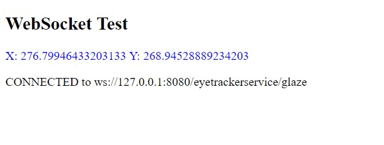
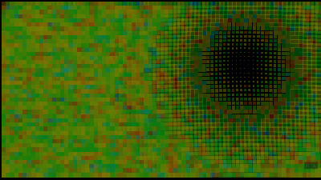

# Eye Tracker Service examples in Javascript
## Example 1 - Connectivity test

It is used only as quick test to check the connectivity to the websocket.  [Click here to see example 1](et-01-connectivity-test/README.md).
   
   

## Example 2 - Generative art

It uses glaze position to control a generative drawning. Drawing from the book **Generative Design**. [Click here to see example 2](et-02-generative-design/README.md).
   
   
