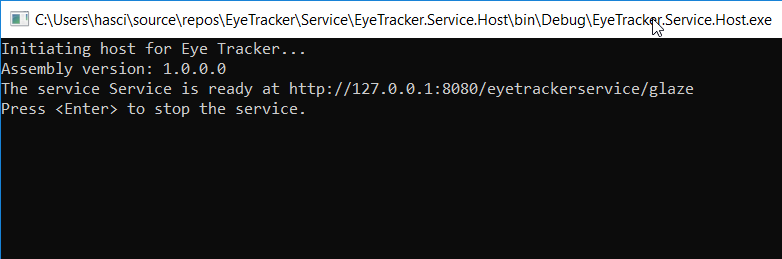

# Example 1 - Connectivity test

It is used only as quick test to check the connectivity to the websocket, from the main project *EyeTracker.Service.Core*. It assumes *EyeTrackerService* is running at 
ws://127.0.0.1:8080/eyetrackerservice/glaze*.  If you change the server URL, make the adjustments in the javascript code.

## How to run 

* Make sure *EyeTracker.Service.Host* is running.

   For example, from Visual Studio, in the solution explorer right-click *EyeTracker.Service.Host* and cihose Debug-> 
   Start new instance. A new console windows should appear, with the following content:

   

   ```
   Initiating host for Eye Tracker...
   Assembly version: 1.0.0.0
   The service Service is ready at http://127.0.0.1:8080/eyetrackerservice/glaze
   Press <Enter> to stop the service.
   ```

* Open index.html in the browser. You should start seeing the glaze positions displayed in the web page, as follows:

   
